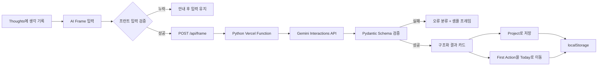
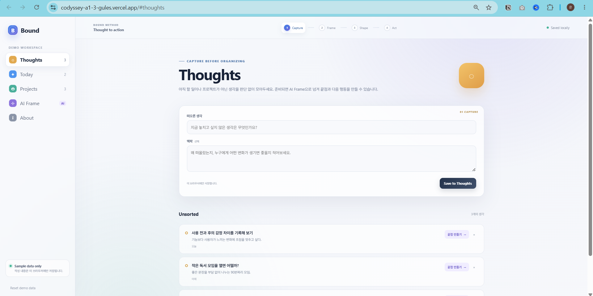
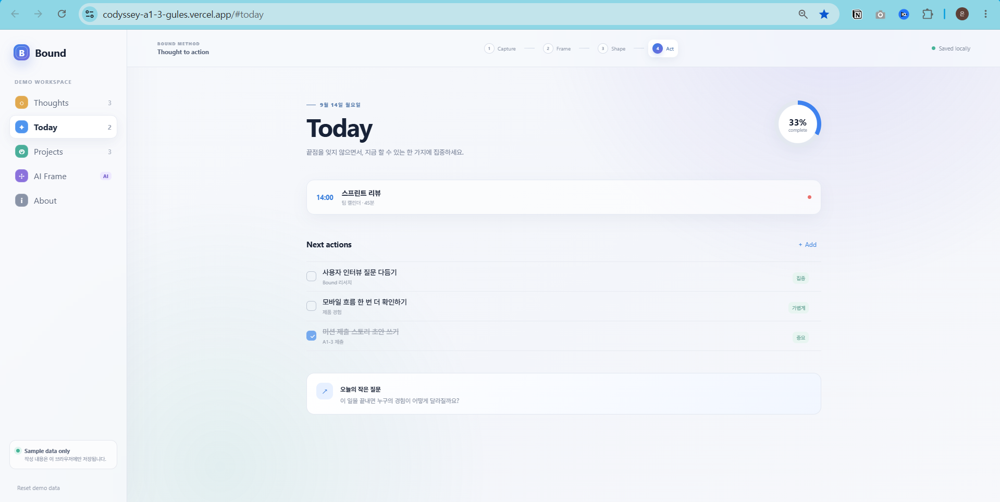
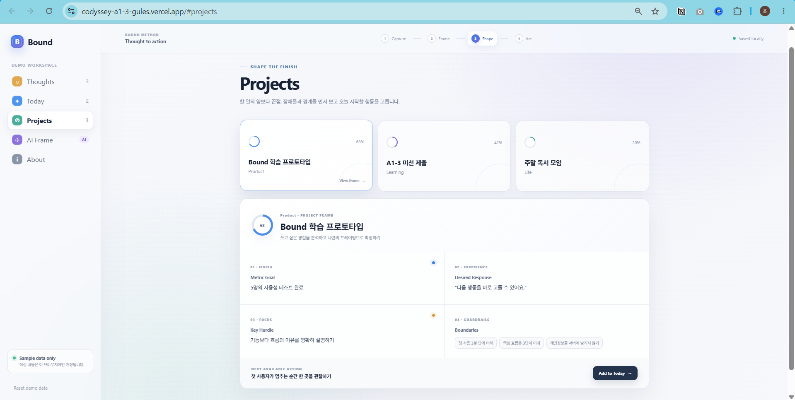
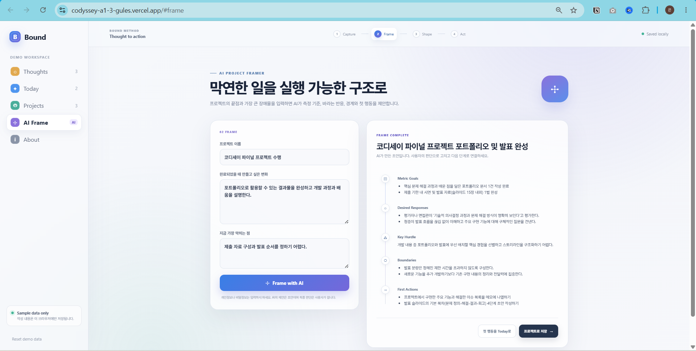
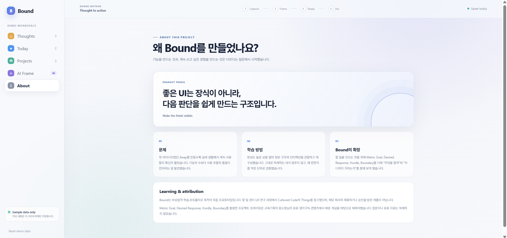
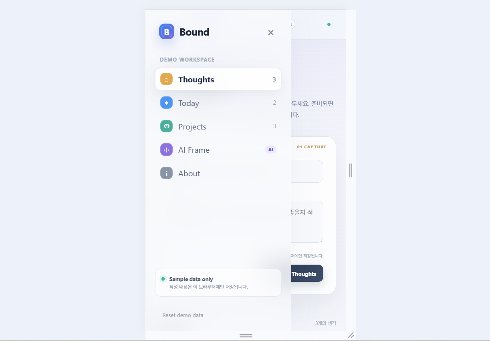
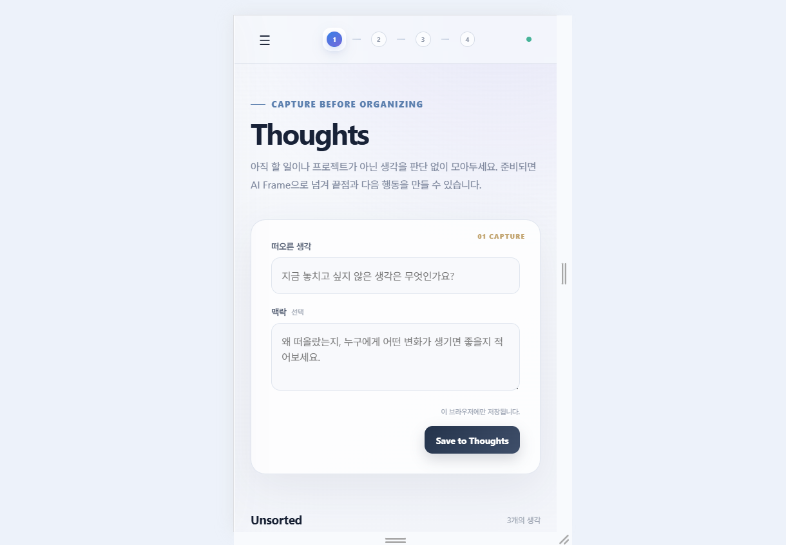
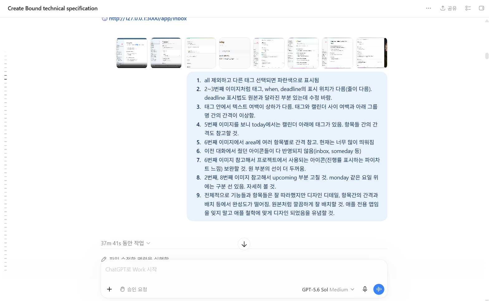
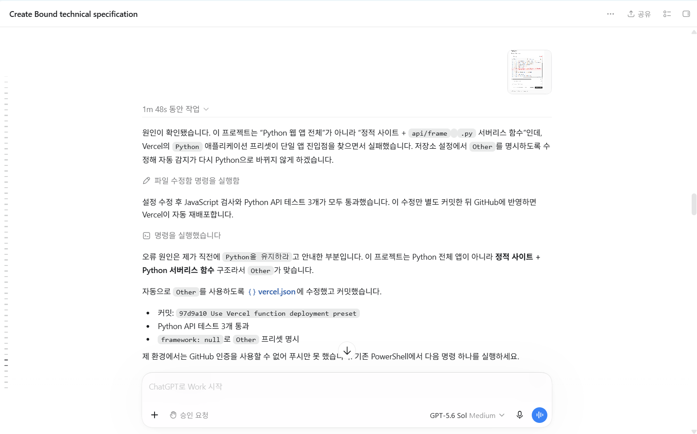

# Bound Mission

> **Codyssey A1-3 · Vanilla Web & AI API**<br>
> 막연한 프로젝트를 측정 가능한 끝점과 오늘 시작할 수 있는 행동으로 바꾸는 AI 프로젝트 프레이밍 도구입니다.

<p align="center">
  <a href="https://codyssey-a1-3-gules.vercel.app"><strong>Live Demo</strong></a>
  &nbsp;·&nbsp;
  <a href="docs/SERVICE_PLAN.md"><strong>Service Plan</strong></a>
  &nbsp;·&nbsp;
  <a href="NOTICE.md"><strong>Notice</strong></a>
</p>

<p align="center">
  
  
  
  
  
</p>

---

## Summary

| 구분 | 내용 |
|---|---|
| 해결한 문제 | 해야 할 일은 늘어나지만 프로젝트의 완료 기준과 첫 행동은 선명하지 않은 문제 |
| 핵심 가치 | 끝점을 `Metric Goal · Desired Response · Hurdle · Boundary`로 구조화하고 실행으로 연결 |
| 대상 사용자 | 개인 프로젝트의 성공 기준과 다음 행동을 구체화하기 어려운 학습자·메이커 |
| 구현 형태 | 반응형 Single Page Web Application |
| 주요 화면 | Thoughts · Today · Projects · AI Frame · About |
| AI 기능 | 프로젝트 맥락을 Gemini에 전달해 구조화된 프레임과 First Actions 생성 |
| Backend | Python Vercel Serverless Function |
| 저장 방식 | 공개 데모 데이터와 브라우저 `localStorage` |
| 안정성 | 입력 검증, 시간 초과, 인증·쿼터·서버 오류 분류, 샘플 프레임 대체 경험 |
| 배포 | [codyssey-a1-3-gules.vercel.app](https://codyssey-a1-3-gules.vercel.app) |

### 바로가기

- [프로젝트 개요](#overview)
- [문제와 해결 방법](#problem--solution)
- [사용자 흐름과 구조](#architecture)
- [핵심 기능](#features)
- [AI 설계](#ai-design)
- [API 키 유출 대응](#security-incident-response)
- [프레임워크 도입 검토](#framework-adoption-review)
- [실행 화면](#screenshots)
- [실행 방법](#how-to-run)
- [테스트](#testing)
- [미션 요구사항 체크리스트](#공식-미션-요구사항-체크리스트)
- [배운 점과 개선 방향](#what-i-learned)
- [학습 목적과 출처](#credits--notice)

---

# Overview

Bound의 출발점은 “프로그램을 만들 수 있는가?”가 아니라 “완성한 뒤에도 실제로 쓰고 싶은가?”라는 질문이었습니다.

이전 프로젝트 `Away`를 만들며 기능을 구현하는 능력과 계속 사용하고 싶은 경험을 설계하는 능력은 다르다는 점을 발견했습니다. 이후 완성도 높은 상용 할 일 앱의 정보 위계, 여백, 편집 흐름, 상태 피드백을 관찰하고 사용자의 판단 부담을 줄이는 원리를 학습했습니다.

Bound Mission은 이 학습을 독자적인 시각 언어와 프로젝트 프레이밍 경험으로 재구성한 공개용 프로토타입입니다. 실제 생활에서 사용하는 Bound와 코드·데이터·배포 환경을 분리하고, 평가자가 개인정보 없이 전체 흐름을 체험할 수 있도록 가상 데이터만 사용했습니다.

## What I Built

1. **Capture Before Organizing**
   - 아직 할 일이나 프로젝트로 확정되지 않은 생각을 `Thoughts`에 먼저 보관
   - 선택적인 맥락과 함께 브라우저에 저장
   - 준비된 생각을 AI Frame 입력으로 전달

2. **Today as an Action Surface**
   - 오늘 실행할 항목 추가·완료·삭제
   - 완료율과 남은 항목 수를 즉시 반영
   - 새로고침 후에도 브라우저에 상태 유지

3. **Project Framing**
   - 수치로 확인하는 `Metric Goal`
   - 결과를 경험한 사람의 `Desired Response`
   - 목표를 직접 막는 하나의 `Hurdle`
   - 해결 방향을 선명하게 하는 `Boundary`

4. **Structured AI Suggestions**
   - Gemini API와 Pydantic JSON Schema 기반 Structured Output
   - 결과를 여섯 영역으로 나눠 검토 가능한 카드로 표시
   - AI 초안을 Project로 저장하고 First Action을 Today로 이동

5. **Resilient Demo Experience**
   - 필수 입력, 요청 과다, 인증, 서버, 연결, 시간 초과 오류를 구분
   - 오류가 발생해도 입력 내용을 유지
   - 외부 API를 사용할 수 없을 때 전체 흐름을 확인할 수 있는 샘플 프레임 제공

## Tech / Tools

| 영역 | 사용 기술 | 역할 |
|---|---|---|
| Frontend | HTML5, CSS3, Vanilla JavaScript | 화면 구조, 반응형 UI, 상태와 상호작용 구현 |
| Backend | Python `BaseHTTPRequestHandler` | `POST /api/frame` 서버리스 엔드포인트 |
| AI | Gemini Interactions API | 프로젝트 맥락을 구조화된 프레임으로 변환 |
| Validation | Pydantic | AI 출력 스키마와 항목 개수 검증 |
| HTTP Client | requests | Gemini REST API 요청과 응답 처리 |
| Persistence | Browser `localStorage` | 공개 데모의 Thoughts·Today·Projects 상태 저장 |
| Deployment | GitHub, Vercel | 코드 버전 관리와 자동 배포 |
| Development | Codex, PowerShell | 구현, 비교 검토, 오류 진단과 반복 개선 |

React나 Vue 같은 프런트엔드 프레임워크 없이 순수 HTML/CSS/JavaScript로 구현했습니다. API 키는 브라우저로 전달하지 않고 Vercel의 서버 환경변수에서만 읽습니다.

---

# Framework Adoption Review

이번 미션은 프런트엔드를 순수 HTML/CSS/JavaScript로 구현해야 하므로 프레임워크를 사용하지 않았습니다. 제약이 없더라도 현재 규모에서는 Vanilla 구성이 의존성·빌드 복잡도를 낮추고 전체 동작을 직접 이해하기에 적합합니다. 다만 화면과 상태가 더 늘어나는 실사용 서비스로 확장한다면 React, Vue 같은 컴포넌트 프레임워크를 다음 기준으로 검토할 수 있습니다.

## 도입 시 장단점

| 구분 | 장점 | 단점과 비용 |
|---|---|---|
| UI 구조 | 반복되는 카드·메뉴·상태 UI를 컴포넌트로 재사용 | 작은 서비스에도 컴포넌트 계층과 규칙이 추가됨 |
| 상태 관리 | Thoughts → AI Frame → Projects → Today의 공유 상태를 명시적으로 관리 | 상태 도구 선택과 데이터 흐름 학습 비용이 생김 |
| 유지보수 | 화면별 파일 분리, 타입 검사, 테스트 자동화에 유리 | 패키지 업데이트와 빌드 도구 유지가 필요함 |
| 사용자 경험 | 복잡한 편집·전환·낙관적 업데이트 구현이 쉬워짐 | 번들 크기와 초기 로딩, hydration 비용을 관리해야 함 |
| 협업 | 널리 쓰이는 패턴과 생태계를 활용 가능 | 단일 HTML·JS보다 구조를 이해하기 위한 사전 지식이 필요함 |

## 예상 변경 범위

| 영역 | 변경 내용 | 영향 |
|---|---|---|
| 프런트 코드 | `index.html` 중심 구조를 App, Navigation, Thoughts, Today, Projects, AI Frame 컴포넌트로 분리 | HTML과 `js/app.js`의 상당 부분 재구성 |
| 상태·저장 | 전역 상태와 `localStorage` 접근을 공통 store/hook 계층으로 이동 | 저장 형식 호환 및 마이그레이션 테스트 필요 |
| 라우팅 | 현재 hash 기반 화면 전환을 클라이언트 라우터로 교체 | 직접 URL 접근을 위한 SPA fallback 또는 Vercel rewrite 필요 |
| 프런트 빌드 | `package.json`, 패키지 잠금 파일, Vite 등의 개발·빌드 명령 추가 | 정적 파일 직접 실행 대신 빌드 산출물 사용 |
| Backend | Python `POST /api/frame` 계약은 그대로 유지 가능 | 프런트 fetch 경로와 CORS 없는 same-origin 동작 재검증 |
| 배포 | Vercel Framework Preset, Build Command, Output Directory 설정 변경 | Preview·Production 빌드와 환경변수 재검증 필요 |
| 테스트 | 기존 Python API 테스트에 컴포넌트·상태·라우팅·E2E 테스트 추가 | 테스트 도구와 CI 실행 단계 증가 |
| 성능·접근성 | 번들 크기, 초기 렌더링, 포커스 이동과 키보드 탐색 재검증 | 모바일과 저사양 환경 회귀 가능성 관리 |

현재 결론은 **미션 및 공개 데모는 Vanilla를 유지**하고, 사용자 계정·동기화·복합 편집처럼 상태 복잡도가 실제로 커질 때 프레임워크 전환의 비용과 효과를 다시 판단하는 것입니다.

---

# Problem & Solution

## Problem

일반적인 할 일 목록은 행동을 기록하는 데 유용하지만, 프로젝트가 **어떤 상태가 되었을 때 끝났다고 판단할지**는 대신 정해주지 않습니다. 완료 상태가 모호하면 다음과 같은 문제가 생깁니다.

- 할 일은 계속 추가되지만 중요한 결과와 연결되지 않는다.
- 수치만 달성하고 실제 사용자의 반응을 놓칠 수 있다.
- 가장 큰 장애물을 정의하기 전에 해결책부터 늘어난다.
- 범위가 커져 오늘 시작할 행동을 고르기 어려워진다.
- 생성형 AI의 자유로운 조언은 항목과 형식이 매번 달라 비교하기 어렵다.

## Solution

Bound는 생각에서 행동까지를 네 단계로 연결합니다.

| 단계 | 사용자 질문 | Bound의 역할 |
|---|---|---|
| Capture | 아직 정리되지 않은 생각은 무엇인가? | Thoughts에 판단 없이 보관 |
| Frame | 어떤 상태가 되면 끝났다고 볼 수 있는가? | Goal, Response, Hurdle, Boundary 정의 |
| Shape | 지금 검토할 수 있는 프로젝트 구조는 무엇인가? | 구조화된 AI 초안을 Project로 저장 |
| Act | 오늘 시작할 수 있는 가장 작은 행동은 무엇인가? | First Action을 Today로 연결 |

AI가 결정을 대신하는 것이 아니라, 막연한 생각을 **사용자가 검토하고 수정할 수 있는 초안**으로 바꾸도록 역할을 제한했습니다.

---

# Architecture



## Request / Response Flow

```text
프로젝트 이름 + 원하는 변화 + 현재 허들
   ↓
JavaScript fetch('/api/frame')
   ↓
Python Vercel Serverless Function
   ↓
Gemini Interactions API + JSON Schema
   ↓
Pydantic 검증
   ↓
Metric Goals / Desired Responses / Key Hurdle
Boundaries / First Actions
   ↓
Project 저장 또는 Today 실행 항목으로 연결
```

## Structured Output Schema

```json
{
  "project_title": "간결한 프로젝트 제목",
  "metric_goals": ["관찰 가능한 수치 기준"],
  "desired_responses": ["대상 사용자가 보일 반응"],
  "key_hurdle": "목표를 가장 직접적으로 막는 장애물",
  "boundaries": ["해결 방향을 선명하게 하는 경계"],
  "first_actions": ["하루 안에 시작할 수 있는 행동"]
}
```

스키마에서 Metric Goals와 Desired Responses는 각각 1~3개, Hurdle은 하나, Boundaries는 2~3개, First Actions는 2~4개로 제한합니다.

---

# Features

## 1. Thoughts — 정리 전 생각 보관

아직 해야 할 일인지, 프로젝트인지 결정하지 않은 생각을 바로 기록합니다. 선택한 생각과 맥락을 AI Frame으로 전달해 정리하기 전에 포착하고, 준비되었을 때 구조화합니다.

## 2. Today — 다음 행동에 집중

오늘 실행할 항목만 보여주고 추가·완료·삭제 결과를 완료율에 반영합니다. AI가 제안한 First Action도 사용자가 선택한 뒤 Today로 옮길 수 있습니다.

## 3. Projects — 끝점과 진행 상태 비교

가상 프로젝트를 선택하면 설명, 진행률, Metric Goal, Desired Response, Hurdle, Boundaries와 Next Action을 함께 보여줍니다. 행동 목록뿐 아니라 프로젝트가 향하는 끝점을 계속 확인할 수 있습니다.

## 4. AI Frame — 막연한 일을 검토 가능한 구조로

다음 세 가지 입력을 받습니다.

- 프로젝트 이름: 필수, 최대 80자
- 완료했을 때 만들고 싶은 변화: 필수, 최대 600자
- 지금 가장 막히는 점: 선택, 최대 400자

AI 결과는 자유로운 긴 조언이 아니라 정해진 여섯 영역으로 표시됩니다. 사용자는 결과를 그대로 확정하지 않고 자신의 맥락에 맞는지 판단한 뒤 프로젝트와 행동으로 연결합니다.

## 5. About — 개발 의도와 학습 맥락

Away에서 Bound로 전환한 이유, 완성도 높은 제품을 관찰한 방식, 독자적으로 추가한 프로젝트 프레이밍 개념, 공개 범위와 참고 관계를 설명합니다.

## 6. Responsive & Accessible Interaction

- 데스크톱 고정 사이드바와 모바일 오버레이 메뉴
- 700px 이하에서 AI 입력과 결과를 한 열로 전환
- 320px에서도 가로 스크롤 없이 핵심 기능 유지
- 의미 있는 `button`, `form`, `label` 요소 사용
- 아이콘 버튼에 접근 가능한 이름 제공
- 동작 줄이기 설정 존중
- 완료 상태를 색뿐 아니라 체크와 텍스트 변화로 전달

---

# AI Design

## AI의 역할

Gemini는 사용자의 프로젝트를 대신 결정하지 않습니다. 입력된 맥락 안에서 완료 기준과 첫 행동의 **초안**을 만들고, 사용자가 서로 다른 기준을 한 화면에서 비교하도록 돕습니다.

## 프레이밍 기준

| 출력 | 기준 |
|---|---|
| Metric Goal | 관찰하거나 셀 수 있는 완료 기준 |
| Desired Response | 결과를 경험한 사람이 말하거나 느끼거나 행동할 반응 |
| Key Hurdle | 결과를 가장 직접적으로 막는 하나의 장애물 |
| Boundary | 할 일이 아닌 실천적 가드레일 |
| First Action | 하루 안에 시작할 수 있는 작은 행동 |

## 안전성과 실패 처리

| 상황 | 사용자 경험 |
|---|---|
| 필수 입력 누락 | API 요청 없이 필요한 입력 안내 |
| 잘못된 JSON 또는 길이 초과 | 입력 형식을 확인하도록 안내 |
| API 키 미설정 | 서버 설정이 필요하다고 안내 |
| 인증 오류 | API 설정 확인 안내 |
| 호출 한도 초과 | 잠시 후 재시도 안내 |
| 서버·연결 오류 | 원인을 짧게 표시하고 입력 유지 |
| 25초 이상 지연 | 브라우저 요청 취소 후 재시도 안내 |
| AI 결과 생성 실패 | 샘플 프레임으로 전체 사용자 흐름 체험 가능 |

사용자 입력은 응답 생성 목적으로 Gemini API에 전달되지만, Bound의 서버 함수는 입력 본문을 별도로 기록하지 않습니다. 공개 화면에서도 개인정보나 비밀정보를 입력하지 않도록 안내합니다.

---

# Security Incident Response

실제 키는 `.env.local`과 Vercel Environment Variables에서만 관리하고 Git에서 제외합니다. 하지만 키가 커밋, 캡처, 로그 또는 제3자에게 노출됐거나 의심되는 경우에는 다음 순서로 대응합니다.

## 즉시 조치

1. Google AI Studio 또는 연결된 Google Cloud 프로젝트에서 노출된 키를 **즉시 무효화**합니다.
2. 필요하면 직전의 안전한 배포로 롤백하거나 AI 기능을 잠시 중지해 추가 호출을 차단합니다.
3. 새 키를 발급하고 가능한 범위에서 Gemini API 제한과 사용량 한도를 적용합니다.
4. Vercel 환경변수와 로컬 `.env.local`을 새 키로 교체하고 Production을 재배포합니다.
5. 노출 시각·위치·관련 커밋과 배포를 키 문자열 없이 기록합니다.

배포 롤백이나 파일 삭제만으로는 이미 복사된 키를 회수할 수 없으므로 **키 폐기가 항상 첫 단계**입니다.

## 조사·복구·통지

- GitHub 커밋·브랜치·Issue·Actions 산출물, 공개 캡처와 포크에서 노출 범위를 조사합니다.
- Vercel 배포·Function 로그와 Gemini 사용량에서 비정상 시각, 상태 코드, 호출량과 비용 영향을 확인합니다.
- Git 기록에 포함됐다면 키 폐기 후 기록을 정리하고, 협업자에게 이력 재작성과 새 클론이 필요한 범위를 알립니다.
- 새 키가 적용된 배포에서 정상 호출과 실패 처리 시나리오를 다시 검증합니다.
- 공개 제출물에 노출됐다면 저장소 관리자와 평가 담당자에게 폐기·정리 상태를 알리고, 비정상 과금이 의심되면 Google 지원 채널에 보고합니다.

## 재발 방지와 감사 로깅

- 개발·Preview·Production 키 분리 및 최소 권한·API 제한 적용
- 호출 쿼터와 예산 알림 설정, Gemini 사용량 정기 확인
- GitHub Secret Scanning·Push Protection 및 CI 비밀 패턴 검사 활용
- 커밋 전 `.env*`, 화면 캡처, 로그와 변경 내역 검사
- Vercel 배포·환경변수 변경 이력과 Gemini 사용량을 감사 자료로 확인
- 감사 로그에는 시각·경로·상태 같은 운영 메타데이터만 남기고 키와 사용자 입력 본문은 제외
- 사고 후 원인, 탐지 경로, 대응 시간과 개선 완료 여부 기록

전체 단계와 복구 완료 기준은 [보안 및 API 키 사고 대응 절차](docs/SECURITY.md)에 정리했습니다.

---

# Live Demo

**배포 주소:** [https://codyssey-a1-3-gules.vercel.app](https://codyssey-a1-3-gules.vercel.app)

추천 체험 순서:

1. Thoughts에 아직 정리하지 않은 생각을 기록합니다.
2. `AI Frame으로`를 눌러 생각을 입력 화면으로 넘깁니다.
3. 원하는 변화와 현재 허들을 입력하고 프레임을 생성합니다.
4. 결과를 Project로 저장합니다.
5. First Action 하나를 Today로 보냅니다.
6. Today에서 완료 처리하고 진행률 변화를 확인합니다.

> 공개 데모는 가상 데이터만 포함하며 입력한 데모 항목은 현재 브라우저에만 저장됩니다.

---

# Screenshots

## 01. Thoughts — 정리하기 전 생각 포착

<p align="center">
  
</p>

## 02. Today — 오늘의 행동과 완료율

<p align="center">
  
</p>

## 03. Projects — 프로젝트 끝점 프레임

<p align="center">
  
</p>

## 04. AI Frame — 입력에서 구조화 결과까지

<p align="center">
  
</p>

## 05. About — 문제의식과 학습 맥락

<p align="center">
  
</p>

## 06. Responsive — 모바일 메뉴와 본문

<p align="center">
  
  &nbsp;&nbsp;
  
</p>

## 07. AI Coding Process — UX 분석과 배포 오류 해결

상용 제품을 참고할 때 화면 전체를 막연히 모방하지 않고 선택 상태, 정보 위계, 여백, 아이콘과 피드백을 관찰 단위로 나눠 반복 개선했습니다.

<p align="center">
  
</p>

Vercel이 프로젝트를 단일 Python 앱으로 감지해 배포가 실패했을 때, 실제 구조가 정적 프런트엔드와 Python Serverless Function의 조합임을 확인했습니다. Framework Preset을 명시하고 자동 테스트를 통과시킨 뒤 재배포했습니다.

<p align="center">
  
</p>

---

# Project Structure

```text
bound-mission/
├── assets/
│   └── images/                  # 제출용 서비스·개발 과정 캡처
├── api/
│   └── frame.py                 # Gemini 호출과 Pydantic 검증
├── css/
│   └── styles.css               # 반응형 UI와 인터랙션 스타일
├── docs/
│   ├── EVIDENCE_CHECKLIST.md    # 제출 증빙 체크리스트
│   ├── QUALITY_UPGRADE_PLAN.md  # 완성도 향상 계획
│   ├── SECURITY.md              # API 키 유출 사고 대응 절차
│   ├── SERVICE_PLAN.md          # 서비스 기획서
│   └── SUBMISSION_STORY.md      # 프로젝트 서사 초안
├── js/
│   └── app.js                   # 화면 상태, 저장, AI 요청과 결과 연결
├── tests/
│   └── test_frame.py            # API 입력·출력·설정 테스트
├── .env.example
├── .gitignore
├── dev_server.py                # 로컬 정적 파일 + API 개발 서버
├── index.html
├── NOTICE.md
├── README.md
├── requirements.txt
└── vercel.json
```

> `.env.local`, `.venv/`, 비공개 캡처와 실제 사용 데이터는 저장소에 포함하지 않습니다.

---

# How to Run

## 1. 저장소 복제 및 폴더 이동

```powershell
git clone https://github.com/qjskffj-code/codyssey_A1-3.git
cd codyssey_A1-3
```

## 2. 가상환경 생성

```powershell
python -m venv .venv
```

## 3. 패키지 설치

```powershell
.\.venv\Scripts\python.exe -m pip install -r requirements.txt
```

## 4. 환경변수 설정

`.env.example`을 복사해 `.env.local`을 만들고 자신의 Gemini API 키를 입력합니다.

```powershell
Copy-Item .env.example .env.local
```

```dotenv
GEMINI_API_KEY=your_gemini_api_key
GEMINI_MODEL=gemini-3.8-flash
```

> 실제 키를 README, 소스 코드, 화면 캡처 또는 Git 커밋에 포함하지 않습니다.

## 5. 로컬 서버 실행

```powershell
.\.venv\Scripts\python.exe dev_server.py
```

브라우저에서 [http://127.0.0.1:4173](http://127.0.0.1:4173)에 접속합니다.

`index.html`을 직접 열면 디자인과 로컬 데모 기능을 확인하는 **Static preview**로 실행되지만 서버 함수가 없으므로 AI Frame은 사용할 수 없습니다.

## 6. Vercel 배포

1. GitHub 저장소를 Vercel의 새 프로젝트로 가져옵니다.
2. 저장소 루트를 Root Directory로 사용합니다.
3. `GEMINI_API_KEY`와 `GEMINI_MODEL`을 Environment Variables에 등록합니다.
4. 배포 후 `/api/frame`의 실제 응답과 모바일 화면을 확인합니다.

`vercel.json`은 정적 프런트엔드와 Python 함수를 함께 배포하도록 Framework Preset을 `Other`로 고정하고, `api/frame.py`의 최대 실행 시간을 30초로 설정합니다.

---

# Testing

## Automated Tests

```powershell
.\.venv\Scripts\python.exe -m unittest discover -s tests -v
```

```powershell
node --check js/app.js
```

| 자동 테스트 | 기대 결과 | 상태 |
|---|---|---|
| Gemini API 키 누락 | 설정 오류를 JSON으로 반환 | PASS |
| 필수 입력 누락 | 외부 API 호출 없이 400 반환 | PASS |
| 유효한 구조화 응답 | 검증된 여섯 영역 반환 | PASS |
| JavaScript 문법 검사 | 구문 오류 없음 | PASS |

## Manual Verification

| 화면·상황 | 확인 내용 | 상태 |
|---|---|---|
| Thoughts | 입력·저장·AI Frame 전달 | PASS |
| Today | 추가·완료·삭제·진행률·새로고침 유지 | PASS |
| Projects | 카드 선택과 상세 프레임 변경 | PASS |
| AI Frame | Gemini 입력 → 구조화 결과 출력 | PASS |
| Connected Flow | AI 결과를 Project와 Today로 연결 | PASS |
| Empty Input | 요청 없이 필수값 안내 | PASS |
| API Failure | 오류 분류, 입력 유지, 샘플 프레임 제공 | PASS |
| Responsive | 데스크톱과 390px 모바일 레이아웃 | PASS |
| Production | Vercel 배포 주소에서 Gemini 호출 | PASS |

---

# 공식 미션 요구사항 체크리스트

## 서비스와 화면

- [x] 배포된 웹 서비스와 공개 URL
- [x] 3개 이상의 페이지 또는 이동 가능한 섹션
- [x] 데스크톱·모바일 반응형 UI
- [x] 순수 HTML/CSS/JavaScript 프런트엔드
- [x] 사용자가 실제로 조작할 수 있는 입력·저장·완료 기능

## AI API

- [x] 사용자 입력 UI
- [x] 프런트엔드 `fetch('/api/frame')` 요청
- [x] `api/`의 Python Vercel Serverless Function
- [x] Gemini API 연동
- [x] Pydantic 기반 Structured Output 검증
- [x] AI 결과를 화면에 출력
- [x] 빈 입력·API 오류·시간 초과 안내
- [x] API 키 환경변수 관리

## 제출 문서

- [x] GitHub 프로젝트 코드와 커밋 이력
- [x] 서비스 소개·기술 스택·실행·배포 방법
- [x] 배포 URL과 환경변수 설정 방법
- [x] 서비스 기획서
- [x] AI 입력·출력·실패 처리 기준
- [x] 데스크톱·모바일·AI 동작 화면 캡처
- [x] AI 코딩 도구 활용 과정 캡처

## 보안·설계 검토

- [x] API 키 유출 시 폐기·재발급·롤백·조사·통지 절차
- [x] 최소 권한·비밀 탐지·감사 로깅을 포함한 재발 방지 계획
- [x] 프레임워크 도입의 장단점과 코드·라우팅·배포·테스트 변경 범위

---

# Key Decisions

## AI보다 먼저 사용자 흐름을 설계한 이유

AI 출력만 보여주는 단일 폼은 결과를 확인한 뒤 사용자가 무엇을 해야 하는지 남겨둡니다. Bound는 Thoughts에서 맥락을 포착하고, AI 초안을 Project에 저장하고, First Action을 Today로 보내는 후속 흐름을 함께 설계했습니다.

## 자유 텍스트 대신 Structured Output을 사용한 이유

프롬프트에 형식만 설명하면 필드명과 항목 수가 달라질 수 있습니다. JSON Schema와 Pydantic을 함께 사용해 AI의 유연한 생성 결과를 화면과 코드가 안정적으로 처리할 수 있는 데이터 계약으로 바꿨습니다.

## 공개용과 실사용 버전을 분리한 이유

실사용 Bound에는 개인 일정과 생활 데이터가 쌓입니다. 공개 저장소에는 코드 학습 결과와 사용자 흐름만 남기고, 가상 데이터와 독립된 배포 환경을 사용해 개인정보·API 키·비공개 자료가 섞이지 않도록 했습니다.

## 완전한 실패보다 대체 경험을 제공한 이유

생성형 AI는 네트워크, 인증, 호출 한도에 영향을 받습니다. 실패 사실은 숨기지 않되 사용자가 제품의 전체 가치 흐름은 이해할 수 있도록 입력을 보존하고 샘플 프레임을 제공합니다.

## 좋은 제품을 관찰하되 그대로 공개하지 않은 이유

완성도 높은 제품의 정보 위계와 상호작용 원리를 분석하는 것은 학습에 유용하지만, 공개 결과물은 독립적이어야 합니다. 따라서 상용 앱의 코드·에셋·콘텐츠를 사용하지 않고 Bound만의 색, 카피, 프레이밍 구조와 가상 데이터로 다시 설계했습니다.

---

# What I Learned

- 바이브 코딩으로 기능을 빠르게 만드는 것과 사람들이 계속 쓰고 싶은 경험을 만드는 것은 다른 문제라는 점을 배웠습니다.
- UI/UX는 장식이 아니라 사용자가 무엇을 보고 어떤 행동을 선택할지 결정하는 정보 구조라는 점을 확인했습니다.
- LLM 출력을 기능에 연결하려면 자연어 품질뿐 아니라 스키마, 검증, 실패 상태가 필요했습니다.
- 프런트엔드 입력이 `fetch`를 거쳐 Python 함수와 Gemini로 전달되고 다시 UI 상태가 되는 전체 흐름을 구현했습니다.
- 로컬과 배포 환경의 차이, Git 소유권 보호, Vercel 프리셋과 Python 함수 진입점 문제를 직접 진단하고 수정했습니다.
- API 키와 실제 데이터를 공개 코드에서 분리하면서 제품 시연과 개인정보 보호를 함께 설계할 수 있었습니다.

## Limitations & Future Work

- 공개 데모 데이터는 브라우저별 `localStorage`에 저장되므로 다른 기기와 동기화되지 않습니다.
- Gemini 결과는 모델과 실행 시점에 따라 달라질 수 있습니다.
- 호출 한도를 초과하면 실제 AI 결과 대신 샘플 프레임으로 체험해야 합니다.
- 현재 AI 결과는 사용자가 저장하기 전에 항목별로 직접 편집할 수 없습니다.
- 자동화 테스트는 API 계약 중심이며 브라우저 상호작용 테스트는 수동 검증에 의존합니다.
- 향후 결과 편집, 내보내기, 키보드 탐색, 스크린 리더 검증과 사용성 측정을 보완할 수 있습니다.

## 한 줄 회고

> 코드를 빠르게 만드는 데서 멈추지 않고, **좋은 제품이 사용자의 판단 비용을 어떻게 줄이는지 관찰하고 이를 끝점에서 첫 행동까지 이어지는 경험으로 재구성했습니다.**

---

# Credits & Notice

Bound Mission은 코디세이 A1-3 및 포트폴리오를 위한 비상업적 학습 프로토타입입니다.

할 일 관리 UX를 학습하는 과정에서 Cultured Code의 Things를 참고했지만 Cultured Code와 제휴하거나 승인을 받은 제품이 아니며, Things의 코드·에셋·콘텐츠를 포함하지 않습니다.

Metric Goal, Desired Response, Hurdle, Boundary 프레이밍은 교육기획자 윤소정님의 유료 생각구독 콘텐츠에서 배운 개념을 프로젝트 관리 경험에 맞게 재해석했습니다. 구독 콘텐츠의 제목·원문·유료 자료는 공개하거나 복제하지 않았습니다.

공개 범위와 참고 관계에 관한 자세한 내용은 [NOTICE.md](NOTICE.md)에서 확인할 수 있습니다.

## License

이 저장소는 학습 결과 검토를 위한 공개 열람용입니다. 별도의 라이선스를 부여하지 않았으므로 코드와 콘텐츠의 재사용·재배포 권한이 자동으로 허용되지 않습니다.

---

# Deliverables

| 결과물 | 경로 또는 주소 |
|---|---|
| 배포 웹 서비스 | [codyssey-a1-3-gules.vercel.app](https://codyssey-a1-3-gules.vercel.app) |
| 프런트엔드 | `index.html`, `css/styles.css`, `js/app.js` |
| Python API | `api/frame.py` |
| 자동 테스트 | `tests/test_frame.py` |
| 환경변수 예시 | `.env.example` |
| 서비스 기획서 | [`docs/SERVICE_PLAN.md`](docs/SERVICE_PLAN.md) |
| 보안·키 유출 대응 절차 | [`docs/SECURITY.md`](docs/SECURITY.md) |
| 제출 스토리 | [`docs/SUBMISSION_STORY.md`](docs/SUBMISSION_STORY.md) |
| 공개 고지 | [`NOTICE.md`](NOTICE.md) |
